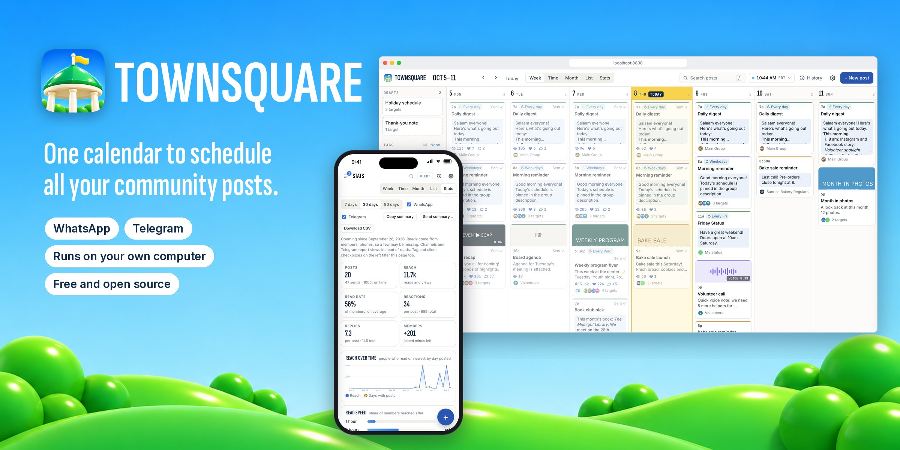
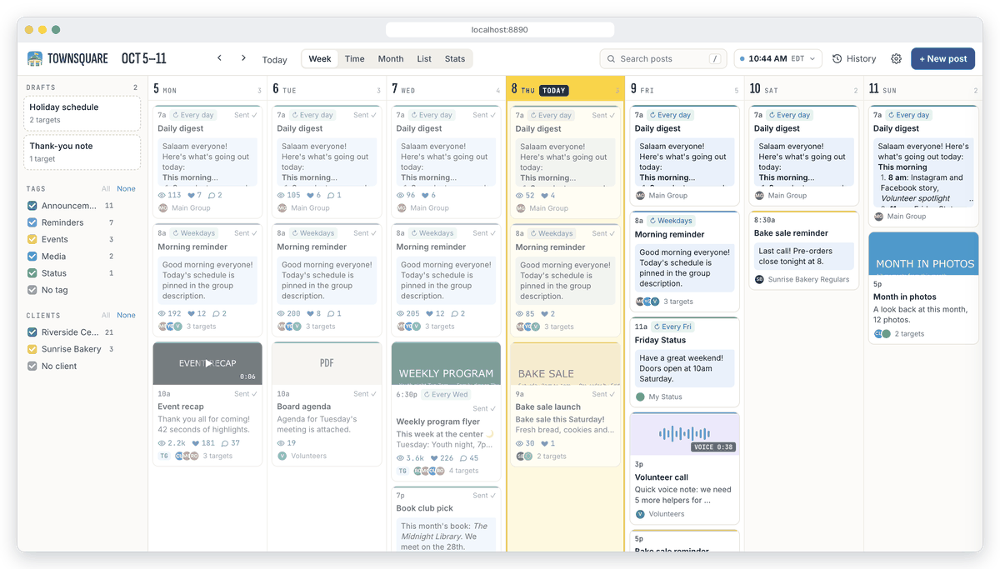
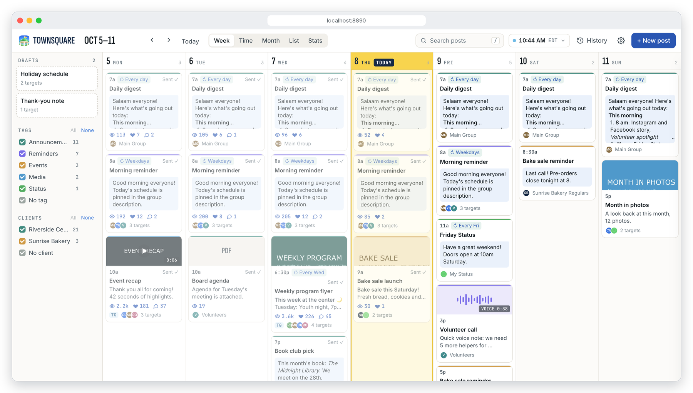
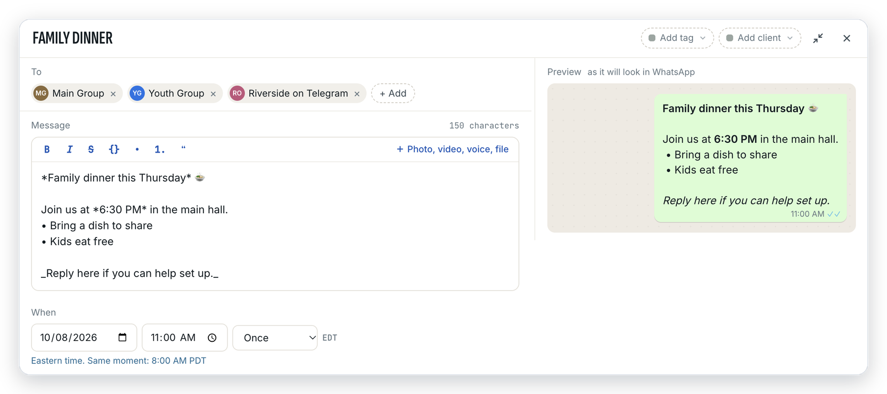
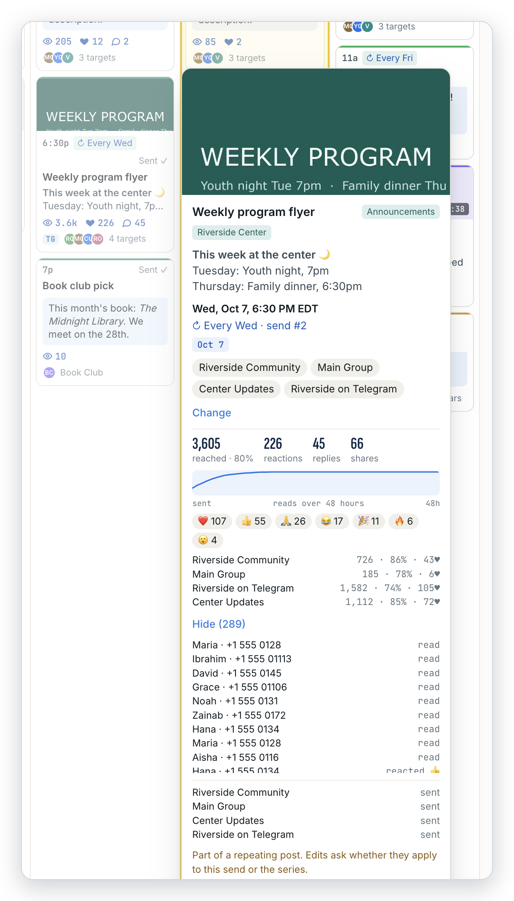
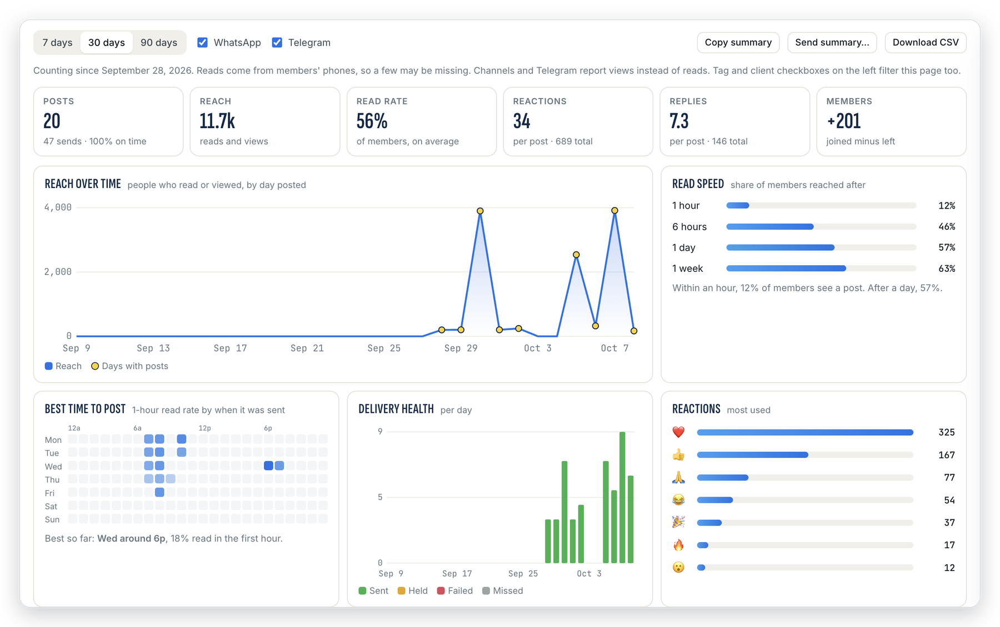
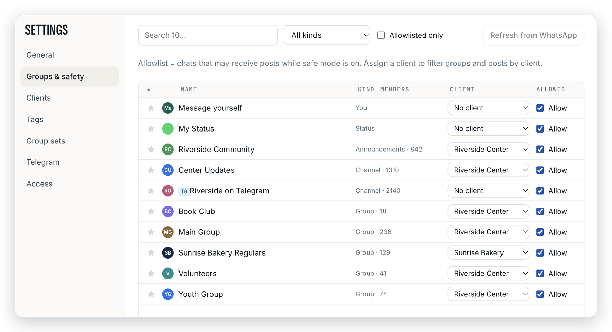
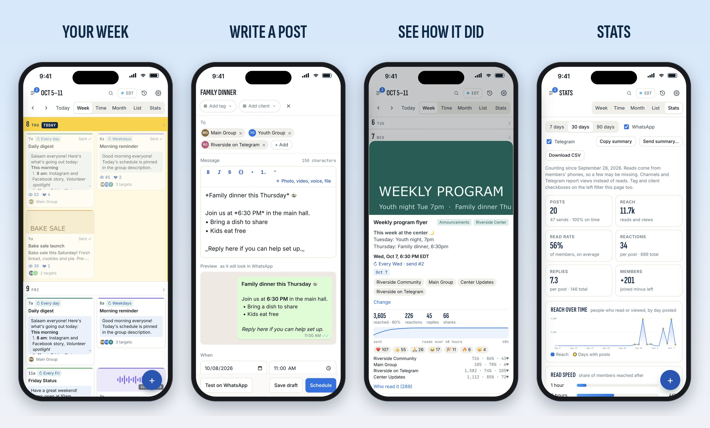

<p align="center">
  
</p>

<p align="center">
  <b>Schedule posts to your WhatsApp and Telegram groups, channels and Status from one calendar.</b><br>
  Free, open source, and it runs on your own computer.
</p>

<p align="center">
  <a href="https://github.com/nerveband/townsquare/releases/latest">Download</a> ·
  <a href="#get-started-in-5-minutes">Get started</a> ·
  <a href="#what-you-can-do">Features</a> ·
  <a href="#questions">Questions</a> ·
  <a href="internal/server/guide.md">API guide</a>
</p>

## Who it's for

Townsquare is for people who post the same news to many groups: mosques, churches, schools,
clubs, community centers and small businesses. Write a message once, pick your groups, pick a
time, and Townsquare sends it for you, even at 6 AM while you sleep. Then see who read it.

## Take a tour

The pictures on this page use the built-in demo, with made-up groups and posts.

<p align="center">
  
</p>

## What you can do

### Plan your week

Every post is a card with its time, picture, groups and a little count of how many people saw it.
Drag a card to move it. Hold ⌥ (Option) while dragging to copy it.



### Write once, send everywhere

Pick groups from WhatsApp and Telegram in one list. Add photos, videos, voice notes or files.
The preview shows exactly how the message will look, bold and lists included. Make it repeat:
"every Wednesday at 6:30 PM" or "every weekday at 8 AM".



### See how each post did

Hover a sent post (or tap it on a phone) to see how many people it reached, the reactions,
the replies, and how fast people read it over the first 48 hours. You can also see who read
it, if you turn that on.

<p align="center"></p>

### Learn what works

The **Stats** page shows reach, read rate, how fast people read, the best time to post,
which kinds of posts do best, which groups respond most, and how many members joined. Copy a
short summary, send it to a chat, or download a spreadsheet.



### Stay safe

Townsquare starts in **safe mode**: it only sends to groups you have checked off. It also
spaces out messages, has a daily limit and quiet hours, and you can undo any change.



### Use it on your phone

Everything works on phones and tablets too.



### And more

- **Telegram:** post as yourself to groups, channels, topics and stories, or use a bot. Telegram
  can even hold your posts on its own servers, so they go out when your computer is off.
- **WhatsApp:** groups, communities, announcement groups, channels and Status.
- **Month and list views,** search, color tags, clients and saved lists of groups.
- **Time zones:** see what time a post goes out anywhere in the world.
- **Undo anything** with ⌘Z. The History panel shows who changed what.
- **For AI assistants and scripts:** everything you can do in the app also works through a
  simple web API.

## Get started in 5 minutes

**1. Download Townsquare** from the [latest release](https://github.com/nerveband/townsquare/releases/latest):

| Your computer | Download | Then |
|---|---|---|
| Mac (Apple chip or Intel) | `Townsquare-…-mac.dmg` | Drag Townsquare to Applications and open it. The first time, macOS may say it can't check the app: open **System Settings → Privacy & Security** and click **Open Anyway**. |
| Windows | `townsquare-…-windows-amd64.exe` | Double-click it. If Windows shows "Windows protected your PC", click **More info → Run anyway**. Keep the black window open while Townsquare runs. |
| Ubuntu, Debian, Raspberry Pi | `townsquare_…_amd64.deb` (PC), `arm64.deb` (Pi 4 or 5, 64-bit), `armhf.deb` (older Pi) | `sudo apt install ./townsquare_*.deb`, then run `townsquare` |

Townsquare opens in your browser at **http://127.0.0.1:8890**, already signed in.

**2. Link WhatsApp.** Click **Link now**. On your phone, go to **WhatsApp → Settings → Linked
devices → Link a device** and scan the code. Your groups and channels show up in a few seconds.

**3. Add Telegram (optional).** Go to **Settings → Telegram**. Follow the link to
[my.telegram.org](https://my.telegram.org) to get a free app ID, paste it in, and scan the QR code
from **Telegram → Settings → Devices → Link Desktop Device**.

**4. Pick where posts may go.** Townsquare starts in safe mode. In **Settings → Groups & safety**,
check **Allow** next to each group you want to post to. That's it: write your first post.

**Keep it running.** Townsquare only sends while it's running, so use a computer that stays on.
In **Settings → General**, check **Start when I log in**.

**Videos and voice notes** need [ffmpeg](https://ffmpeg.org/download.html). On a Mac:
`brew install ffmpeg`. On Linux: `sudo apt install ffmpeg`.

### Updates happen on their own

Townsquare checks for a new version every 6 hours. It downloads it, checks that it's really from
us (every release is signed), and switches over when no post is due in the next 15 minutes.
You can also click **Check for updates** in Settings, or run `townsquare update`. Don't want
automatic updates? Uncheck **Install updates automatically**.

### Try the demo first

Want to look around before linking anything? Run Townsquare with sample groups and posts, like
the pictures above. It never connects to WhatsApp or Telegram, so nothing can be sent:

```sh
townsquare serve --demo          # Mac app: /Applications/Townsquare.app/Contents/MacOS/townsquare-server serve --demo
```

### Prefer the command line?

Every download also comes as a plain program (`townsquare-…-linux-arm64` and so on). Run
`townsquare help` to see the commands: `pair` links WhatsApp in the terminal, `serve` runs the
server, `login-link` prints a sign-in link, and `update` updates it. On Linux,
`systemctl --user enable --now townsquare` keeps it running in the background (on a Pi without a
screen, also run `sudo loginctl enable-linger $USER`).

### Open it from your phone

If you use [Tailscale](https://tailscale.com), Townsquare can get its own private web address
that only your devices can reach:

```sh
./townsquare serve --tailscale townsquare
```

The first time, it prints a link to approve. Then open **https://townsquare.your-tailnet.ts.net**.

## Why run it on your own computer?

Townsquare links to WhatsApp the same way WhatsApp Web does. WhatsApp watches for accounts that
act like robots, and messages from a cloud server look suspicious. A computer at home or at
work looks normal. Your messages and numbers also stay on your computer.

## Questions

**Will I get banned?**
Nobody can promise that, because WhatsApp doesn't officially support tools like this. You lower
the risk by running it at home, posting to groups you run, keeping the pause between groups,
and staying under the daily limit in Settings.

**Does Townsquare read my chats?**
No. It doesn't save your messages. For the stats, it only counts what happens to posts
Townsquare sent: read receipts, reactions, replies and views. Names are kept only if you turn
on "who read it" lists, and even then they are deleted after 30 days.

**Can I put it on a cloud host for one-click setup?**
We don't recommend it. Cloud servers raise the chance that WhatsApp flags your number.

**Can an AI assistant use it?**
Yes. Create a key in **Settings → API keys**, then point your assistant at `/api/v1/guide.md`
on your Townsquare. The full reference is at `/api/v1/docs`.

## For developers

Read [AGENTS.md](AGENTS.md) before changing anything: every feature ships in both the app and
the API. Changes are listed in [CHANGELOG.md](CHANGELOG.md). Useful commands: `make check`,
`make build`, `make deploy`, `make release V=v0.6.0`. Screenshots come from `serve --demo`.

Built with Go, [whatsmeow](https://github.com/tulir/whatsmeow), [gotd](https://github.com/gotd/td),
SQLite and Svelte. Not affiliated with WhatsApp, Meta or Telegram.

## License

Townsquare is free software under the [GNU AGPL v3](LICENSE). You can use it, change it and share
it. If you change it and let other people use your version (including over the internet), you must
share your changes under the same license.
